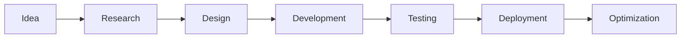

<div align="center">


</div>

<table>
<tr>
<td width="58%">

# Hi 👋, I'm Nivritha

### AI Engineer • Generative AI Developer • Full Stack Developer


<br>

💡 Passionate about building intelligent AI systems  
⚡ Focused on scalable backend & full-stack architectures  
🚀 Exploring Agentic AI, LLMs, and RAG systems  
🌍 Open Source Contributor & Hackathon Enthusiast  
📚 Constantly learning emerging AI technologies  

<br>

<p align="left">
  

  
</p>

</td>

<td width="42%">


</td>
</tr>
</table>

---

# 💫 About Me


```yaml
Name: Nivritha
Role: AI Engineer & Full Stack Developer
Education: B.Tech CSE @ Anurag University
Focus:
  - Generative AI
  - Machine Learning
  - NLP & RAG Systems
  - Full Stack Engineering
  - Backend Development

Currently Building:
  - AI-powered applications
  - Real-time intelligent systems
  - Scalable backend architectures
```

💡 Passionate about building intelligent, scalable, and production-ready systems integrating AI with modern software engineering.

⚡ Experienced in developing AI applications using LLMs, NLP, MERN Stack, Spring Boot, and scalable backend architectures.

🌱 Interested in solving real-world problems using Generative AI, automation, and intelligent workflows.

<br clear="right"/>

---

# 🚀 Technical Expertise

<div align="center">

| AI & Machine Learning | Backend & APIs | Full Stack Development |
|---|---|---|
| LLM Applications | Spring Boot APIs | MERN Stack |
| Prompt Engineering | REST APIs | React.js |
| NLP Systems | FastAPI & Flask | Responsive UI |
| RAG Pipelines | Authentication Systems | Real-Time Apps |
| Deep Learning | Microservices | Scalable Frontends |

</div>

---

# 🏆 Achievements

<div align="center">

| 🏅 Achievement | 📌 Description |
|---|---|
| 🥇 National-Level Hackathon Winner | Built KPI-driven urban emissions dashboard |
| 🥈 Ideathon Runner-Up | Presented scalable real-world innovation |
| 🎯 Hackathon Finalist | Microsoft x Reskill & Adobe India |
| 🚀 OpenAI Buildathon Selection | Selected at state level |
| 🌟 Graphs Camp Selection | Selected among 80,000+ applicants |
| 📜 Patent Filed | “AI Virtual Professor” intelligent learning system |

</div>

---

# 💻 Tech Arsenal

<div align="center">

## Languages


## AI / ML & GenAI


## Frontend


## Backend & APIs


## Database & ORM


## State Management & Validation


## Cloud & DevOps


## Tools


</div>

---

# 🧠 Areas of Interest

<div align="center">

| Artificial Intelligence | Software Engineering | Data & Analytics |
|---|---|---|
| Generative AI | Backend Engineering | Data Visualization |
| Machine Learning | REST API Development | KPI Dashboards |
| NLP & Transformers | Full Stack Systems | Business Analytics |
| RAG Systems | Scalable Architectures | Reporting Solutions |
| AI Automation | Cloud-ready Applications | Data-driven Insights |

</div>

---

# 📊 GitHub Analytics

<div align="center">


<br><br>


</div>

---

# 📈 Contribution Graph

[](https://github.com/Nivritha03)

---

# 🚀 GitHub Activity

<div align="center">


</div>

---

# 📌 Developer Dashboard

<div align="center">

| Domain | Expertise |
|---|---|
| 🤖 Generative AI | Advanced |
| 🧠 Machine Learning | Advanced |
| 🌐 Full Stack Development | Advanced |
| 🔎 NLP & RAG Systems | Intermediate |
| ⚙️ Backend Engineering | Intermediate |
| 🚀 Open Source | Active Contributor |

</div>

---

# 🧩 Development Philosophy

<div align="center">

```text
✓ Build scalable and maintainable systems
✓ Focus on impactful AI-driven products
✓ Prioritize performance and usability
✓ Write clean production-ready code
✓ Learn continuously and adapt quickly
✓ Engineer solutions for real-world problems
```

</div>

---

# 🔍 Profile Insights

<div align="center">

```yaml
Interests:
  - Generative AI
  - Machine Learning
  - NLP
  - Backend Engineering
  - Full Stack Development
  - Open Source

Current Focus:
  - AI-powered applications
  - Intelligent automation systems
  - Scalable backend architectures
  - Real-time AI products

Career Vision:
  - Building impactful AI systems at scale
```

</div>

---

# 📊 Coding Activity

<div align="center">


<br><br>


<br><br>


</div>

---

# 🛠 Workflow

<div align="center">



</div>

---

# 💭 Philosophy

<div align="center">


</div>

---

# 🌐 Connect With Me

<div align="center">

<a href="https://www.linkedin.com/in/nivritha-pola-b8b4b52a0/">
  
</a>

<a href="https://dynamic-portfolio-showcase--23eg105r21.replit.app/">
  
</a>

<a href="mailto:nivritha.pola@gmail.com">
  
</a>

</div>

---

<div align="center">

### ⭐ Building intelligent systems that create real-world impact

</div>


